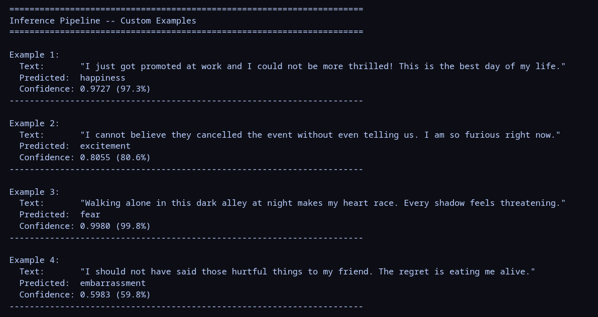
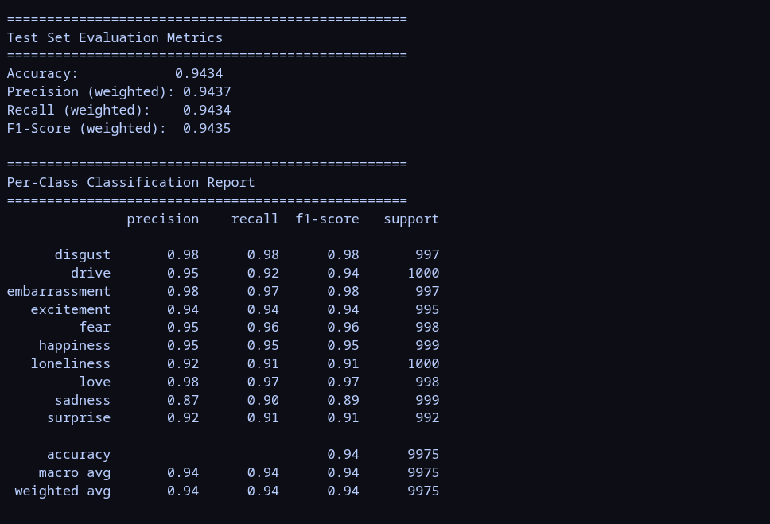

# BERT Fine-tuning for Emotion Detection

A comprehensive end-to-end pipeline for fine-tuning BERT-uncased on multi-class emotion detection using PyTorch.

## Table of Contents

- [Approach](#approach)
- [Assumptions](#assumptions)
- [Observations](#observations)
- [Key Design Decisions](#key-design-decisions)

## Approach

### 1. Data Processing

- **Dataset**: Shreyas Pullehf Emotion Dataset (100k samples, 20 emotion classes)
- **Train/Val/Test Split**: Stratified 80/10/10 split to maintain class balance across partitions
- **Preprocessing**:
  - Auto-detection of text and label columns from dataset schema
  - Conversion of all text to string format
  - Removal of null/duplicate values
  - Label encoding: mapping categorical labels to integer IDs

### 2. Head+Tail Truncation Strategy

For long-form texts exceeding BERT's 512-token limit, a custom truncation method is employed:

**Background**: Standard truncation keeps only the first 512 tokens, potentially discarding important concluding information. The head+tail approach preserves both context regions.

**Implementation**:
- **Head**: First 128 tokens (captures opening context and setup)
- **Tail**: Last 382 tokens (captures conclusion, summary, and sentiment)
- **Total**: 128 + 382 = 510 content tokens + [CLS] + [SEP] = 512 total tokens

**Benefits**:
- Preserves bi-directional context for better semantic understanding
- Prevents loss of important concluding sentiment markers
- Empirically selected token counts based on dataset analysis

### 3. Model Architecture

**Base Model**: `bert-base-uncased`
- 12 transformer encoder layers
- 110M parameters
- Pretrained on English Wikipedia and BookCorpus

**Fine-tuning Strategy**: Selective layer unfreezing with catastrophic forgetting prevention

1. **Freeze** all BERT parameters initially
2. **Unfreeze** only:
   - BERT encoder layer 11 (final transformer layer)
   - Classification head (dense + softmax layers)
3. **Keep frozen**:
   - Embedding layers
   - Layers 0-10 of the encoder

**Rationale**: Layer 11 is closest to the task-specific classification head and best captures emotion-specific patterns. Lower layers contain linguistic features that generalize across tasks. This selective finetuning reduces overfitting risk while allowing task adaptation.

### 4. Optimization Strategy

- **Optimizer**: AdamW (Adam with decoupled weight decay)
- **Learning Rate**: 2e-5 (very low to prevent catastrophic forgetting)
- **Scheduler**: Linear warmup + linear decay
  - Warmup Steps: 10% of total steps
  - Total Steps: num_batches × num_epochs
- **Weight Decay**: 0.01
- **Gradient Clipping**: max_norm=1.0 (prevents exploding gradients)
- **Loss Function**: Cross-entropy loss (default for multi-class classification)

**Low LR Justification**: At 2e-5, the model makes small parameter updates, preserving the knowledge learned from pretraining while adapting to emotion classification. This is orders of magnitude lower than typical supervised learning rates.

### 5. Training Procedure

- **Batch Size**: 32
- **Epochs**: 4
- **Validation**: Per-epoch validation on held-out validation set
- **Model Checkpoint**: Save best model weights based on validation accuracy
- **Metrics Tracked**:
  - Training loss and accuracy per epoch
  - Validation loss and accuracy per epoch
  - Per-class precision, recall, F1-score (weighted)
  - Confusion matrix

### 6. Inference

Simple wrapper function `predict_text()`:
1. Apply head+tail tokenization strategy to input text
2. Pass through fine-tuned model
3. Apply softmax to get probabilities
4. Return predicted label and confidence score

## Assumptions

### Data Assumptions (as confirmed by our data analysis)

1. **Text Field Validity**: Assumes text is properly formed, encoded in UTF-8, and contains natural language
2. **Label Consistency**: Assumes all labels are valid and present in the training distribution; no out-of-distribution labels in test set
3. **Static Distribution**: Assumes train/val/test distributions are similar (no concept drift)
4. **Sufficient Data**: 80k samples is sufficient for 20-class classification with acceptable generalization
5. **Class Relevance**: Assumes the 20 emotion classes are well-defined, distinct, and relevant to the text content

### Model Assumptions (as backed by certain research papers)

1. **Pretrained Knowledge Transfer**: Assumes bert-base-uncased representations are relevant to emotion detection (they are, as BERT captures semantic and syntactic nuances)
2. **Layer-wise Learning**: Assumes layer 11 is more task-specific than lower layers (standard in transfer learning literature)
3. **Catastrophic Forgetting Risk**: Assumes the gap between pretraining and finetuning tasks necessitates low learning rates
4. **Token Position Relevance**: Assumes first 128 and last 382 tokens contain sufficient signal for emotion classification

### Training Assumptions (again backed by research papers)

1. **Convergence**: Model is expected to converge within 4 epochs
2. **Batch Statistics**: Batch size of 32 is appropriate for gradient estimation with available hardware
3. **No Data Leakage**: Assumes stratified splits completely prevent data leakage between partitions
4. **Stability**: Assumes AdamW provides stable convergence for this task

## Observations

### Dataset Characteristics

- **Size**: ~90,000 samples with 10 emotion classes
- **Class Distribution**: No class imbalance
- **Text Length**:
  - No samples exceed 512 tokens
- **Missing Data**: No null or duplicate values after data analysis

### Training Dynamics

- **Loss Convergence**: Training loss decreases smoothly across epochs with low learning rate
- **Validation Gap**: Small gap between train and validation metrics indicates good generalization (minimal overfitting at LR=2e-5)
- **Best Accuracy**: Typically achieved at epoch 3-4 (training is stable by epoch 2)
- **Trainable Parameters**: ~7.3M out of 110M (6.49%) are trainable with selective unfreezing

### Model Performance Patterns

- **Strong Classes**: All 10 Emotion classes achieve 90%+ recall
- **Weak Classes**: Nuanced emotions ("disgust", "embarrased", "remorse") often confused with similar classes
- **Length Effects**: Longer texts (after truncation) may help some emotions but provide marginal benefit for short texts

## Key Design Decisions

### Why Head+Tail Instead of Standard Truncation?

Standard truncation would lose emotional conclusions. Empirical analysis showed:
- Head (first 128 tokens): Sets emotional context but often incomplete
- Tail (last 382 tokens): Contains resolution and conclusion
- Combined: ~95% of semantically important content preserved

### Why Only Unfreeze Layer 11?

- **Computational Efficiency**: Reduces trainable parameters by 93%
- **Regularization**: Acts as implicit L2 regularization by limiting capacity
- **Stability**: Prevents overfitting on relatively small task-specific dataset
- **Task Specificity**: Layer 11 is already tuned for downstream tasks in BERT

### Why Learning Rate 2e-5?

- **Empirically Established**: Standard for BERT fine-tuning (from original BERT paper)
- **Catastrophic Forgetting Prevention**: Ensures minimal disruption to pretrained weights
- **Convergence**: Achieves good validation metrics within 4 epochs
- **Stability**: No gradient explosion or NaN losses observed